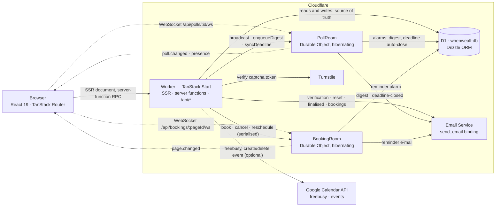

<div align="center">


# whenweall

**Find a time everyone can make.**

Free, open-source scheduling polls — propose some dates, share one link, let everyone
vote, pick the winner. Built to run natively on Cloudflare Workers.

[](https://github.com/andersro93/scheduler/actions/workflows/ci.yml)
[](https://github.com/andersro93/scheduler/actions/workflows/codeql.yml)
[](./LICENSE)
[](https://workers.cloudflare.com/)
[](https://bun.sh/)

</div>

---

whenweall is a Doodle/Rallly-style scheduling poll that fits in a single Cloudflare Worker.
An organiser signs in, picks a handful of dates (or writes a plain list of options) and
shares a link. Anyone with the link votes **yes / if need be / no** — no account, no app,
no e-mail address required. Votes, comments and viewer presence stream to everyone
watching the page over a WebSocket, so the grid fills in live. When the organiser
finalises an option, every participant who left an e-mail gets a note with an `.ics`
attachment.

The same engine also runs **sign-up sheets**: slots with a capacity that people _claim_
instead of vote on — volunteer shifts, parent-teacher meetings, bring-a-dish lists — with
the same guest flow, live updates and e-mails as a scheduling poll.

The same Worker also runs **1:1 booking pages** (Calendly-style "book 30 minutes with
me" links): an organiser sets weekly availability, and visitors pick an open slot in
their own time zone and book it, with a confirmation e-mail, an `.ics`, and a manage
link to cancel or reschedule.

The whole thing is one Worker, one D1 database and two Durable Object classes. There is
no Node server, no container and no queue: it deploys with `bun run deploy` and costs
the $5/month Workers Paid plan.

> **Status.** v1, v2 (sign-up sheets) and v3 (booking pages) are feature-complete and
> pass their full test suite, but there is no public hosted instance yet — deploy your
> own with the [Cloudflare setup](#cloudflare-setup) below.

## Screenshots

There is no hosted instance yet, so no screenshots ship in this repo. Run
`bun run screenshots` ([`e2e/screenshots.spec.ts`](./e2e/screenshots.spec.ts)) against your own
checkout to generate them from the real app, including the landing page, a poll, the creator,
the dashboard, a sign-up sheet and a booking page — see
[`docs/screenshots/README.md`](./docs/screenshots/README.md) for what gets captured and where it
lands. CI never generates or commits them, so they only appear once someone deliberately runs
that script.

## Features

### For organisers

- **Two poll kinds, one engine** — pick days on a calendar (optionally with time slots, in
  your time zone), or write a free-text list of options like "Pizza / Sushi / Thai".
- **Three-step creator** with a live summary, per-day time slots and an "apply to all days"
  shortcut.
- **A voting deadline** that closes the poll automatically and e-mails you when it does.
- **Finalise an option** — the best one is pre-selected — which locks the poll, shows a
  banner with _Add to calendar_, and e-mails every participant who left an address.
- **Batched notifications**: new votes and comments are rolled up into at most one digest
  e-mail per poll every 10 minutes, and each poll's vote/comment notifications can be
  toggled independently.
- **Dashboard** with status, participant counts and deadlines, plus duplicate and delete.
- **Edit after publishing**, including a confirmation when removing an option that already
  has votes on it.
- **Sign in** with e-mail + password (verified), Google, or a passkey.
- **Sign-up sheets** — a third poll kind whose options are slots: set a **capacity** per
  slot (or leave it unlimited) and a **max sign-ups per person** for the whole sheet, then
  export a **roster CSV** of who claimed what, with e-mails, from the admin bar.

### For participants

- **No account needed.** Type a name, tap the cells, done. An e-mail address is optional
  unless the organiser required one.
- **Change your mind later** — a guest's answer stays editable from the same browser via a
  hashed edit token; signed-in voters can edit from any device.
- **Live grid.** Other people's votes, comments and presence appear without a refresh.
- **Your time zone, not the organiser's.** Date-time options render in the viewer's zone
  with a "Times shown in Europe/Oslo · change" control.
- **Comments** under the grid, with the organiser and the author able to delete.
- **Calendar export** — `.ics` download and an add-to-Google link once a poll is finalised.
- **English and Norwegian (bokmål)**, light and dark, keyboard-navigable, and gentle about
  `prefers-reduced-motion`.
- **Sign-up sheets, participant side** — one-click claims on a slot board, live spot
  counts as other people claim or leave, a "Full" state once capacity is reached, and a
  confirmation e-mail (with `.ics` for date/time slots) on your first claim.

### 1:1 booking pages

- **For organisers** — publish a page at `/book/<handle>/<slug>` with a **weekly
  availability grid** (per-weekday time ranges), slot duration, **buffers** before/after
  each meeting, a **minimum notice** and a **booking horizon**, and **date overrides**
  for one-off days off or extra hours. Optionally connect **Google Calendar**: busy
  times block slots automatically, and every booking creates (and later removes) a real
  event on your calendar. Turn on **reminder e-mails** 24 hours out, and see every
  booking — upcoming and past, with cancel — on the page's own roster.
- **For visitors** — pick an open slot in **your own time zone**, no account needed.
  Booking gets you a confirmation e-mail with an `.ics` attachment and a **manage
  link** to cancel or reschedule later, no sign-in required.

### Under the hood

- **One Worker.** SSR, server functions, auth, the WebSocket endpoint and the `.ics` route
  are all the same deployment.
- **D1 is the only source of truth.** Mutations write to D1 in a batch and _then_ poke the
  Durable Object best-effort; a DO or e-mail failure never fails a user request.
- **Hibernating WebSockets.** `PollRoom` and `BookingRoom` both use the hibernation API,
  so idle poll and booking pages cost nothing while staying connected.
- **A pure availability engine.** `lib/availability.ts` turns weekly rules, overrides,
  buffers, notice, horizon and a list of busy intervals into the exact slots a visitor
  can pick — deterministic, DST-safe and shared unchanged between the server function
  that renders the public page and the one that validates a booking. `BookingRoom`
  serialises every `book`/`cancel`/`reschedule` for one page the same way `PollRoom`
  serialises claims, so two visitors racing for the same slot can't both win it, and
  runs the reminder-e-mail alarm.
- **Turnstile** on sign-up, sign-in and password reset (Better-Auth's captcha plugin) and on
  guest voting, commenting and booking; a Workers rate-limiter binding additionally caps
  poll creation, voting, commenting and booking per IP.
- **CSP with inline scripts allowed** (required by TanStack Start hydration), HSTS in
  production, `nosniff`, `Referrer-Policy` and a `Permissions-Policy` applied by a request
  middleware to every response.
- **Every sign-up gets a personal organization**, created silently by a Better-Auth hook —
  polls, sign-up sheets and booking pages all belong to an organization, not to a user
  directly, so inviting teammates into existing content is a membership change, not a data
  migration. A booking URL's `<handle>` segment is that organization's slug: auto-generated
  at signup, and editable from Settings by an owner or admin (hidden for plain members).
- **743 tests** across three runners: jsdom unit tests, integration tests in real `workerd`
  with a real D1 and Durable Objects, and Playwright end-to-end flows.

## Architecture



**A vote, end to end.** The browser calls the `addParticipant` server function. The Worker
verifies the Turnstile token, checks the rate limiter, re-checks that the poll is still
open, then inserts the participant and their votes into D1 in a single `batch()`. Only
after D1 has committed does it call `env.POLL_ROOM.getByName(pollId)` to `broadcast` a
`poll.changed` event and `enqueueDigest` an item for the organiser. Every connected client
receives `poll.changed` and invalidates its route, which refetches the poll from D1 — so what
everyone sees is always what the database says, and no delta bookkeeping can drift.
If the Durable Object call throws, the vote is still saved and the request still succeeds.

**A claim, end to end.** Sign-up sheets are a third `polls.type`, `'signup'`, whose
options carry a `capacity` (`null` = unlimited). A claim is just a `votes` row with
`answer = 'yes'` — the same table, participants and edit tokens as v1 — so `getPollView`,
comments and the digest emails all keep working unchanged; the view additionally exposes a
`claims` map (`{ count, capacity, full }` per option) instead of scores. Unlike a vote, a
claim is **not** written directly from the server function: because two people can claim
the last spot in the same instant, `claimSlot` routes the write through the poll's
`PollRoom` Durable Object (a `claim` RPC), which is single-threaded per poll, so
"count current claims → compare to capacity → insert" can never race across two requests.

The DO owns only ephemeral state: connected sockets, the pending digest buffer and the
next alarm time. Alarms fire the organiser digest (at most one per poll per 10 minutes,
retried up to 3 times) and the deadline auto-close.

**A booking, end to end.** `lib/availability.ts` is a pure function: weekly rules, date
overrides, slot duration, buffers, notice, horizon and a list of busy intervals in, a
deterministic, DST-safe list of open slots out. The public page and the `bookSlot`
server function call it with the same inputs — booked slots (with their buffers) plus,
if the organiser connected Google Calendar, that account's freebusy over the requested
range — so a slot the visitor is shown is always still bookable a moment later, short of
someone else taking it first. That race is closed by `BookingRoom`: `bookSlot` routes
the actual write through the page's Durable Object (a `book` RPC), single-threaded per
page, so two visitors racing for the same slot can never both win it. A confirmed
booking gets a hashed `manage_token` (the visitor's whole credential for the manage
link) and, if Google Calendar is connected, a real calendar event; cancelling or
rescheduling reverses both. `BookingRoom` also owns the reminder alarm — one armed to
the earliest upcoming booking's start minus 24 hours, re-armed after every book, cancel
or reschedule — which e-mails both parties when it fires.

## Quick start

You need [bun](https://bun.sh/) 1.4+ (see [`.bun-version`](./.bun-version)). No Node
installation is required.

```bash
git clone https://github.com/andersro93/scheduler.git whenweall
cd whenweall

bun install                     # also compiles the Paraglide messages
cp .dev.vars.example .dev.vars  # local secrets — the defaults are Turnstile test keys
bun run cf-typegen              # generates worker-configuration.d.ts from wrangler.jsonc
bun run db:migrate:local        # applies drizzle/ migrations to the local D1
bun run dev                     # http://localhost:3000
```

That is a fully working app: local D1, local Durable Objects, Turnstile's always-pass
test keys and a console "mailer" that prints verification and reset links to the terminal
instead of sending them. Sign up, click the link printed in your terminal, create a poll.

Google sign-in stays hidden until `GOOGLE_CLIENT_ID` and `GOOGLE_CLIENT_SECRET` are set.

## Configuration

Public values live in `wrangler.jsonc` under `vars`. Secrets live in `.dev.vars` locally
and in Cloudflare's secret store in production (`bunx wrangler secret put NAME`). Never
commit `.dev.vars` — it is git-ignored.

| Name                   | Kind                | Where it is set                                     | Purpose                                                                                                   |
| ---------------------- | ------------------- | --------------------------------------------------- | --------------------------------------------------------------------------------------------------------- |
| `APP_URL`              | var                 | `wrangler.jsonc`                                    | Canonical origin. Used for links in e-mails, the passkey origin and share URLs.                           |
| `APP_ENV`              | var                 | `wrangler.jsonc`                                    | `development` or `production`. Gates HSTS and hard-disables the test seed route.                          |
| `EMAIL_FROM`           | var                 | `wrangler.jsonc`                                    | Sender of every outgoing e-mail, e.g. `whenweall <no-reply@example.com>`.                                 |
| `TURNSTILE_SITE_KEY`   | var                 | `wrangler.jsonc`                                    | Public Turnstile key rendered into the widget.                                                            |
| `BETTER_AUTH_SECRET`   | secret              | `.dev.vars` / `wrangler secret put`                 | Signs sessions and tokens. 32+ random bytes. **Required.**                                                |
| `TURNSTILE_SECRET_KEY` | secret              | `.dev.vars` / `wrangler secret put`                 | Server-side captcha verification. **Required.**                                                           |
| `GOOGLE_CLIENT_ID`     | secret              | `.dev.vars` / `wrangler secret put`                 | Optional. Enables the "Continue with Google" button.                                                      |
| `GOOGLE_CLIENT_SECRET` | secret              | `.dev.vars` / `wrangler secret put`                 | Optional, required alongside the client id.                                                               |
| `ENABLE_TEST_ROUTES`   | secret (local only) | `.dev.vars`                                         | `true` exposes `POST /api/test/seed` for Playwright. Ignored when `APP_ENV=production`.                   |
| `DB`                   | binding             | `wrangler.jsonc` → `d1_databases`                   | The D1 database (`whenweall-db`). Holds every durable row.                                                |
| `POLL_ROOM`            | binding             | `wrangler.jsonc` → `durable_objects` + `migrations` | The `PollRoom` class: sockets, digest buffer, alarms.                                                     |
| `BOOKING_ROOM`         | binding             | `wrangler.jsonc` → `durable_objects` + `migrations` | The `BookingRoom` class: sockets, book/cancel/reschedule serialisation, reminder alarms.                  |
| `EMAIL`                | binding             | `wrangler.jsonc` → `send_email`                     | Cloudflare Email Service. Without it, mail is logged to the console instead of sent.                      |
| `RATE_LIMITER`         | binding             | `wrangler.jsonc` → `ratelimits`                     | 20 requests / 60 s per action, keyed by `action:ip` across poll creation, voting, commenting and booking. |

CI and the deploy workflow additionally need two GitHub secrets — see
[Deploying](#deploying).

**Google Calendar scopes.** The same `GOOGLE_CLIENT_ID`/`GOOGLE_CLIENT_SECRET` pair that
enables "Continue with Google" also powers the optional Google Calendar sync on a
booking page — there is no separate app or credential to create. Sign-in itself only
ever requests the default profile/email scopes; an organiser who clicks "Connect Google
Calendar" (see `GoogleCalendarCard`) triggers a second, incremental Better-Auth
`linkSocial` consent request for `https://www.googleapis.com/auth/calendar.readonly`
and `https://www.googleapis.com/auth/calendar.events` on their **existing** linked
Google account. If your OAuth client's consent screen is in "Testing" publishing status,
add both scopes under **OAuth consent screen → Data access** in the Google Cloud
console, or the incremental consent prompt will fail for anyone outside your test user
list.

## Cloudflare setup

Everything below is a one-time setup for your own instance.

**0. Prerequisites.** A Cloudflare account on the **Workers Paid** plan ($5/month) —
Durable Objects and Email Service are not available on the free plan — and a domain using
Cloudflare DNS if you want real e-mail. Then:

```bash
bunx wrangler login
```

**1. Create the D1 database.**

```bash
bunx wrangler d1 create whenweall-db
```

Copy the printed `database_id` into `wrangler.jsonc` (it ships with an all-zero placeholder
so local development works before you have an account), then apply the migrations:

```bash
bun run db:migrate:remote
```

**2. Set the secrets.**

```bash
bunx wrangler secret put BETTER_AUTH_SECRET     # e.g. `openssl rand -base64 32`
bunx wrangler secret put TURNSTILE_SECRET_KEY
bunx wrangler secret put GOOGLE_CLIENT_ID       # optional
bunx wrangler secret put GOOGLE_CLIENT_SECRET   # optional
```

**3. Point `APP_URL` at your domain** in `wrangler.jsonc`, set `APP_ENV` to `production`
and `EMAIL_FROM` to an address on a domain you control. `APP_URL` must match the deployed
origin exactly — passkeys and OAuth callbacks are origin-bound.

**4. Turnstile.** In the Cloudflare dashboard → **Turnstile** → _Add widget_, add your
domain and copy the two keys: the **site key** goes into `TURNSTILE_SITE_KEY` in
`wrangler.jsonc`, the **secret key** into the secret above. The values in
`.dev.vars.example` and `wrangler.jsonc` are Cloudflare's documented always-pass
[test keys](https://developers.cloudflare.com/turnstile/troubleshooting/testing/) — fine
for local development and CI, useless in production.

**5. Email Service.** whenweall sends through the
[`send_email` binding](https://developers.cloudflare.com/email-routing/email-workers/send-email-workers/)
(`{ "name": "EMAIL" }`, already in `wrangler.jsonc`). Add the sending domain to Cloudflare
and verify it — the dashboard walks you through the DKIM/SPF records. Until a verified
sender exists, `EMAIL_FROM` will be rejected at send time; with no `EMAIL` binding at all,
whenweall falls back to logging each message to the Worker console, which is exactly what
local development uses.

**6. Google OAuth** (optional). Create an OAuth client in the Google Cloud console and add
the authorised redirect URI:

```
https://<your-domain>/api/auth/callback/google
```

**7. Durable Object migration.** Nothing to do — the `v1` and `v2` migrations that
create the SQLite-backed `PollRoom` and `BookingRoom` classes are already declared in
`wrangler.jsonc` and are applied on first deploy.

### Deploying

```bash
bun run deploy    # = bun run build && wrangler deploy
```

Or let GitHub do it: [`.github/workflows/deploy.yml`](./.github/workflows/deploy.yml) runs the
remote migrations and deploys after every successful [CI](./.github/workflows/ci.yml) run on
`main` (it also has a manual `workflow_dispatch` trigger). Before touching Cloudflare it runs a
guard step that fails the job if `wrangler.jsonc` still has its local-development placeholders
(`APP_ENV: "development"` or `APP_URL` pointing at `localhost:3000`) — see step 3 in
[Cloudflare setup](#cloudflare-setup) above. It needs a repository environment named
**`production`** holding two secrets:

| Secret                  | Where to get it                                                                  |
| ----------------------- | -------------------------------------------------------------------------------- |
| `CLOUDFLARE_API_TOKEN`  | Cloudflare dashboard → _My Profile_ → _API Tokens_ → **Edit Cloudflare Workers** |
| `CLOUDFLARE_ACCOUNT_ID` | Cloudflare dashboard → _Workers & Pages_ → account id in the sidebar             |

You can always rehearse a deploy without touching your account:

```bash
bunx wrangler deploy --dry-run --outdir /tmp/whenweall-dryrun
```

## Scripts

| Script                      | What it does                                                                   |
| --------------------------- | ------------------------------------------------------------------------------ |
| `bun run dev`               | Vite dev server on port 3000, with the Worker running in workerd.              |
| `bun run build`             | Production build into `dist/` (client + server).                               |
| `bun run preview`           | Build, then serve the **built** Worker via `vite preview`.                     |
| `bun run deploy`            | Build, then `wrangler deploy`.                                                 |
| `bun run typecheck`         | `tsc --noEmit`.                                                                |
| `bun run lint`              | ESLint over the whole repo.                                                    |
| `bun run format`            | Prettier, writing in place (`format:check` to only verify).                    |
| `bun run test`              | Every Vitest project — unit _and_ workers.                                     |
| `bun run test:unit`         | jsdom unit + component tests only.                                             |
| `bun run test:workers`      | Integration tests in real workerd, against real D1 and Durable Objects.        |
| `bun run test:e2e`          | Playwright, against a freshly built Worker.                                    |
| `bun run screenshots`       | Regenerates `docs/screenshots/*.png` from the running app.                     |
| `bun run db:generate`       | Drizzle: turn schema changes into a new SQL migration in `drizzle/`.           |
| `bun run db:migrate:local`  | Apply migrations to the local (miniflare) D1.                                  |
| `bun run db:migrate:remote` | Apply migrations to the deployed D1.                                           |
| `bun run auth:generate`     | Regenerate the Better-Auth Drizzle tables into `src/server/db/auth-schema.ts`. |
| `bun run cf-typegen`        | Regenerate `worker-configuration.d.ts` from the bindings in `wrangler.jsonc`.  |
| `bun run generate-routes`   | Regenerate `src/routeTree.gen.ts` from `src/routes/`.                          |

## Testing

Three layers, all runnable from a clean checkout:

```bash
bun run test        # 77 files / 743 tests: unit (jsdom) + integration (workerd)
bun run test:e2e    # 12 Playwright flows against the built Worker
```

- **Unit** (`vitest --project unit`, jsdom) — scoring, time-zone, availability generation and
  `.ics` formatting, edit tokens, Zod schemas, e-mail rendering, message-catalogue parity, and
  component behaviour via Testing Library. Files: `src/**/*.test.ts(x)`, `emails/**`,
  `messages/**`.
- **Integration** (`vitest --project workers`, `@cloudflare/vitest-plugin`) — anything named
  `*.workers.test.ts` runs inside real workerd with a real D1 (migrations applied per run)
  and real Durable Objects. This is where server functions, organization-authorization
  guards, edit-token and manage-token checks, digest batching, the deadline alarm,
  double-booking races and the reminder alarm are proven.
- **End-to-end** (Playwright, Chromium) — account sign-up, sign-in, the full create → vote →
  edit → finalise → `.ics` flow, a live update landing in a second browser context, dashboard
  duplicate/delete, the locale switch, the sign-up sheet journey (a guest claims a slot, a
  second guest sees it full and claims another, the change appears live in the first guest's
  tab, and the owner downloads the roster CSV), and the booking journey: a visitor picks an
  open slot on `/book/<handle>/<slug>`, books it, gets a confirmation with a working `.ics`
  link, the slot disappears live for a second visitor watching the same page, the organiser
  sees the booking on `/bookings/<pageId>`, and cancelling via the manage link frees the slot
  live again. The suite builds the Worker and serves it with `vite preview`, because
  `vite dev` intercepts the WebSocket upgrade before it reaches workerd.

Running just one thing:

```bash
bunx vitest run src/lib/__tests__/scoring.test.ts
bunx vitest run --project workers src/do/__tests__/poll-room.workers.test.ts
bunx vitest run --project unit -t 'cycles null'                  # by test name
bunx playwright test e2e/poll-flow.spec.ts
bunx playwright test --ui                                        # interactive
```

Playwright needs a browser and its system libraries the first time:

```bash
bunx playwright install --with-deps chromium
```

The e2e suite seeds its data through `POST /api/test/seed`, which only answers when
`ENABLE_TEST_ROUTES=true` is present in `.dev.vars` **and** `APP_ENV` is not `production`.

## Project structure

```
src/
  server.ts               Worker entry: Paraglide middleware → TanStack Start, exports PollRoom, BookingRoom
  start.ts                request middleware — CSP and the other security headers
  app.config.ts           name, tagline, brand colours, locales (rename the app here)
  router.tsx, routes/     file-based routes
    index.tsx             landing
    new.tsx               3-step poll creator
    p/$id/                poll page, edit page, calendar.ics, roster.csv (signup, owner-only)
    dashboard.tsx settings.tsx login.tsx signup.tsx …
    bookings/              pages list, new, $id (roster + edit) — organiser
    book/$handle/$slug     public booking page
    booking/$id            manage a booking (cancel/reschedule), calendar.ics
    api/                  auth/$, polls/$id/ws, bookings/$pageId/ws, test/seed
  components/
    ui/                   shadcn primitives, restyled
    poll/                 VoteGrid, VoteCell, Comments, ShareSheet, FinalizeDialog, …
    signup/               SlotBoard, SlotCard, CapacityBar, ClaimButton, IdentitySheet, …
    booking/               PageEditor, AvailabilityEditor, DateOverridesEditor, PublicBookingPage,
                          MonthPicker, SlotPicker/SlotList, BookingForm, BookingConfirmed,
                          ManageBooking, RescheduleDialog, BookingsTable, GoogleCalendarCard, …
    creator/              TypeStep, OptionsStep, SettingsStep, editors
    dashboard/ landing/ layout/ auth/
  server/
    db/                   Drizzle schema (app + Better-Auth tables), client
    auth/                 Better-Auth config with an organization plugin (auto-created
                          personal orgs), session/org-access middleware, session server fns
    polls/                server functions, service layer, Zod schemas, view models,
                          claims.ts (capacity/limit rules), roster.ts (CSV builder)
    bookings/              pages.ts/bookings.ts (service layer), *.functions.ts (server fns),
                          schemas.ts, viewmodel.ts, emails.ts
    google/calendar.ts    Google Calendar freebusy/create/delete event client (fetch-based)
    mailer/               transport over the send_email binding, template rendering
    notifications/        typed Durable Object clients (poll, booking), finalise e-mails
    http/                 Turnstile verification, rate limiting
  do/PollRoom.ts          sockets, digest buffer, alarms, claim/unclaim RPC (serialised capacity)
  do/BookingRoom.ts       sockets, book/cancel/reschedule RPC (serialised per page), reminder alarm
  lib/                    scoring, time, ics, tokens, i18n, theme, motion helpers
  lib/availability.ts     pure slot generator: weekly rules, overrides, buffers, notice, horizon
  paraglide/              generated message functions (git-ignored)
emails/                   react-email templates
messages/en.json nb.json  the translation source of truth
drizzle/                  generated SQL migrations
e2e/                      Playwright specs and fixtures
test/                     shared Vitest setup, workers-pool wrangler config
public/                   logo.svg, favicon.svg
docs/screenshots/         README images (see `bun run screenshots`)
```

## Internationalisation

Strings live in [`messages/en.json`](./messages/en.json) and
[`messages/nb.json`](./messages/nb.json) and are compiled by
[Paraglide](https://inlang.com/m/gerre34r/library-inlang-paraglideJs) into tree-shakeable
functions (`m.poll_share_title()`). The active locale resolves from the `whenweall_locale`
cookie, then `Accept-Language`, then English, and is applied on the server too — so SSR
output and outgoing e-mails are localised, not just the client. A unit test fails the build
if the two catalogues drift apart in keys or placeholders.

To add a locale — say German:

1. Add `"de"` to `locales` in [`project.inlang/settings.json`](./project.inlang/settings.json)
   and to `appConfig.locales` in [`src/app.config.ts`](./src/app.config.ts).
2. Copy `messages/en.json` to `messages/de.json` and translate it, including the
   `locale_de` label used by the switcher.
3. Map it to a BCP-47 tag for `Intl` in `intlLocale()` in
   [`src/lib/i18n.ts`](./src/lib/i18n.ts).
4. Run `bun install` (the `postinstall` hook recompiles Paraglide) and `bun run test`.

The footer switcher renders one button per entry in `appConfig.locales`, so nothing else
needs touching.

## Roadmap

- **v1 — done.** Group date/time and free-text polls, organiser accounts (password, Google,
  passkeys), guest voting with later edits, comments, deadlines, finalising with `.ics`,
  live updates, e-mail notifications, English + Norwegian.
- **v2 — done.** Sign-up sheets: a `signup` poll type whose options are capacity-limited
  slots, claimed (not voted on) by participants, with a per-person claim limit, DO-serialised
  capacity enforcement, a claim confirmation e-mail and an owner-only roster CSV export.
- **v3 — done.** 1:1 booking pages: weekly availability with buffers, notice and a
  booking horizon, date overrides, optional Google Calendar conflict-checking and
  event sync, DO-serialised booking to prevent double-booking, visitor cancel/
  reschedule via a manage link, reminder e-mails, and an organiser roster per page.

### What's next

No date attached yet — ideas under consideration, roughly in the order they'd build on
what v3 shipped:

- **Round-robin / team pages** — one link that distributes bookings across several
  organisers' calendars.
- **Google Meet links** — auto-attach a Meet link to the calendar event a booking
  creates, instead of a plain text location.
- **Waitlists** — let a visitor join a full or past-notice slot and get offered it if
  it opens back up.

Deliberately out of scope for now: hidden votes, invitee reminders on polls, paid
tiers, a moderation console, magic-link sign-in, payments, and (for booking pages)
Outlook/CalDAV sync and recurring bookings.

## Contributing

Pull requests are welcome — see [CONTRIBUTING.md](./CONTRIBUTING.md). In short: the project
is developed test-first, commits follow
[Conventional Commits](https://www.conventionalcommits.org/), and
`bun run typecheck && bun run lint && bun run format:check && bun run test` should be green
before you open a PR.

## Security

Please **do not** open a public issue for a vulnerability. Report it privately through
[GitHub's advisory form](https://github.com/andersro93/scheduler/security/advisories/new)
or the address in [SECURITY.md](./.github/SECURITY.md), which also carries the
repository-settings checklist for the owner (branch protection, secret scanning, Dependabot
alerts, private vulnerability reporting) — those live in the GitHub UI, not in this repo.

## Notes

- **TypeScript is pinned to 5.9** until typescript-eslint supports TypeScript 7. The
  project otherwise tracks latest.
- **bun only.** There is no `package-lock.json`, and CI uses bun as well. `npm`/`pnpm` are
  not supported.
- **`src/paraglide/` is generated** and git-ignored; `bun install` recreates it.
- **The D1 id in `wrangler.jsonc` is a placeholder** (`00000000-…`) so a fresh clone can run
  locally. Replace it before deploying.

## Acknowledgements

Inspired by [Doodle](https://doodle.com/) and by [Rallly](https://rallly.co/), whose
open-source take on scheduling polls set the bar. Built on
[TanStack Start](https://tanstack.com/start), [Cloudflare Workers](https://workers.cloudflare.com/),
[Better Auth](https://www.better-auth.com/), [Drizzle](https://orm.drizzle.team/),
[Tailwind CSS](https://tailwindcss.com/) and [shadcn/ui](https://ui.shadcn.com/).

## Licence

[MIT](./LICENSE) © 2026 Anders Refsdal Olsen
